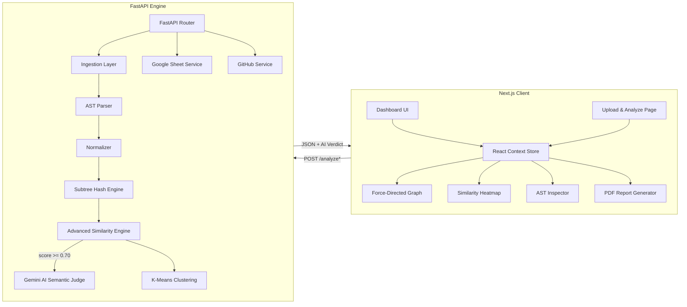
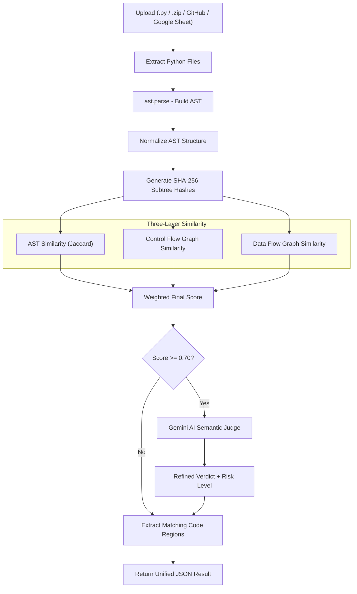
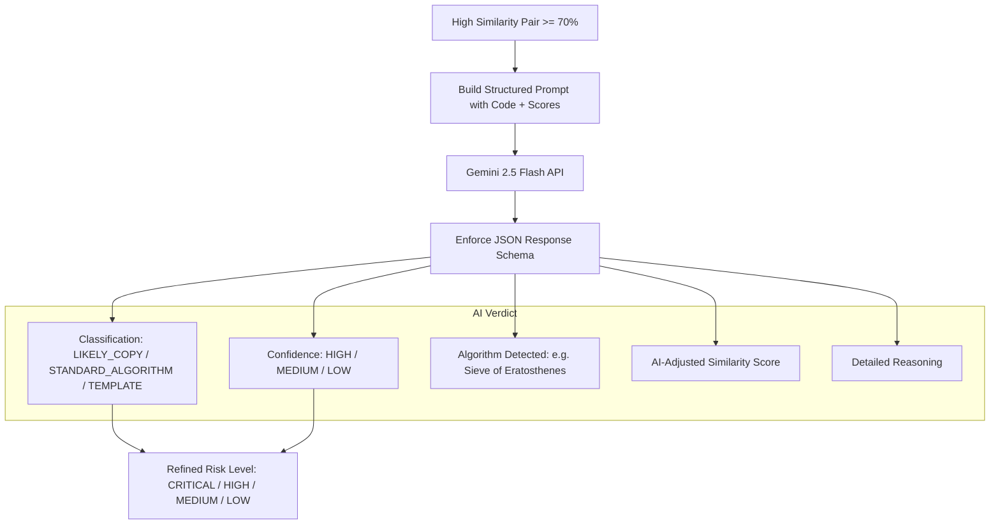
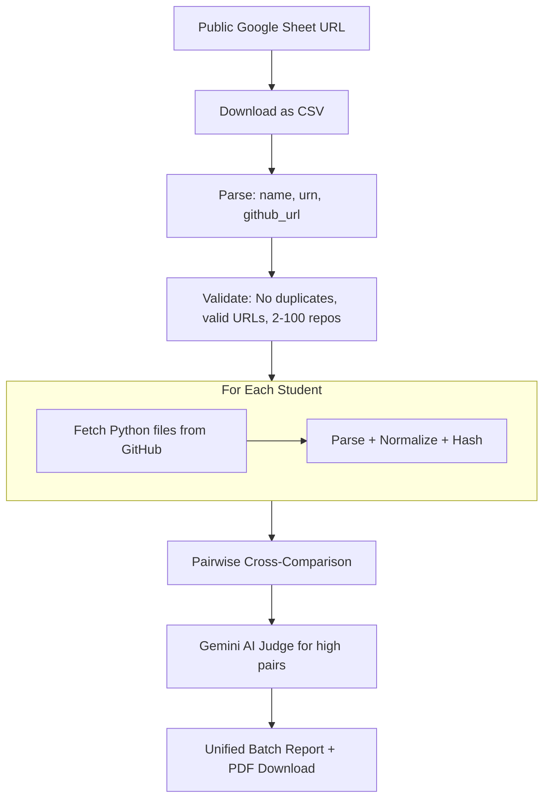
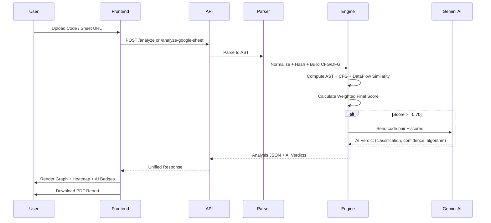

# CLONIQ – Code Similarity Detection Tool

A smart tool that finds copied code by analyzing structure, not just text. Powered by **AST + CFG + DataFlow** structural analysis and **Gemini AI Semantic Judge**.

🔗 **Try it Live:** [https://cloniq-puce.vercel.app](https://cloniq-puce.vercel.app)  
📁 **Project Assets / Documentation:** [Google Drive Folder](https://drive.google.com/drive/folders/1xL9q75p5FJ1rLelhwpsGjYiMA6sSHxTV?usp=sharing)

---

## What Problem Does This Solve?

**The Problem:**  
Students and developers sometimes copy code and make small changes (like renaming variables or adding spaces) to hide plagiarism. Normal text comparison tools can't catch these tricks.

**Our Solution:**  
CLONIQ looks at the *structure* of the code (like a blueprint) instead of just the text. When structural similarity is high (≥ 70%), our **Gemini AI layer** performs semantic analysis to determine if it's a genuine copy or just a common algorithm pattern.

---

## Who Is This For?

- **Universities** – Check student assignments for plagiarism via Google Sheets batch upload
- **Coding Platforms** – Detect cheating in online tests
- **Companies** – Find duplicate code in large projects
- **Hiring Teams** – Verify candidates write original code

---

## How Does It Work?

1. **Upload Code** – Python, JavaScript, TypeScript files, ZIP folders, GitHub links, or a **Google Sheet** of student repos
2. **Convert to Blueprint** – Code is parsed into AST, CFG, and Data Flow graphs
3. **Clean It Up** – Variables, formatting, and comments are normalized away
4. **Find Patterns** – Structure is broken into fingerprinted subtrees
5. **Compare** – Three-layer similarity (AST + CFG + DataFlow) is computed
6. **AI Judge** – If similarity ≥ 70%, Gemini AI confirms: copied, template, or standard algorithm
7. **Show Results** – Visual dashboard with graphs, heatmaps, and **downloadable PDF report**

---

## System Diagrams

### Full System Architecture



### Processing Pipeline



### Gemini AI Semantic Judge Flow



### Google Sheet Batch Analysis Flow



### Similarity Computation



### Similarity Formula

```
Final Score = 0.4 × AST + 0.3 × CFG + 0.3 × DataFlow

Where:
  AST Similarity:  J(A, B) = |A ∩ B| / |A ∪ B|  (Jaccard on subtree hashes)
  CFG Similarity:  Structural comparison of control flow graphs
  DFG Similarity:  Data dependency pattern matching
```

---

## Technology Used

**Frontend & Desktop Apps:**
- Next.js 14 (App Router) – Modern web framework
- Electron – Standalone macOS Desktop App (.dmg export)
- TypeScript – Type-safe programming
- TailwindCSS – Premium dark-mode styling
- Framer Motion – Smooth animations
- jsPDF + AutoTable – PDF report generation
- React Icons (Heroicons) – UI icons

**Backend (The Engine):**
- FastAPI – High-performance Python API
- AST & Tree-Sitter – Universal code structure parser for Python, JS, and TS
- Three-Layer Similarity – AST + CFG + DataFlow
- Gemini 2.5 Flash – AI semantic judge
- K-Means Clustering – Groups similar files
- Google Sheets Integration – Batch analysis via public sheets

---

## Features

✅ **Upload Options:**
- Python (.py) and JavaScript/TypeScript (.js, .jsx, .ts, .tsx) files
- ZIP folder with multiple files
- Two GitHub repository URLs
- 🆕 **Google Sheet** with student repo links (batch mode)

✅ **Analysis Engine:**
- Three-layer structural comparison (AST + CFG + DataFlow)
- Detects renamed variables and reformatted code
- Ignores whitespace, comments, and docstrings
- Shows exact matching code regions with line numbers

✅ **AI Semantic Judge:**
- 🆕 Gemini AI evaluates high-similarity pairs (≥ 70%)
- Classifies: LIKELY_COPY, STANDARD_ALGORITHM, or TEMPLATE
- Detects known algorithms (Sieve, Binary Search, etc.)
- Provides AI-adjusted similarity score with reasoning

✅ **Visualization:**
- Interactive force-directed similarity graph
- Color-coded heatmap matrix
- AST structure tree viewer
- AI verdict badges on suspicious pairs

✅ **Reporting:**
- 🆕 **Downloadable PDF report** with:
  - Analysis summary and stats
  - Student list with URNs (batch mode)
  - Suspicious pairs table with risk levels
  - Side-by-side matching code lines
  - Color-coded risk indicators
  - Fetch error log

✅ **Standalone Desktop App:**
- 🆕 Secure, offline-capable macOS Desktop client packaged with Electron!

---

## API Endpoints

| Method | Endpoint | Description |
|--------|----------|-------------|
| POST | `/analyze` | Analyze multiple .py, .js, .ts files |
| POST | `/analyze-pair` | Compare exactly two files |
| POST | `/demo-analyze-pair` | 🆕 Auth-free endpoint for quick pairwise testing |
| POST | `/analyze-advanced` | Two files with full AST + CFG + DataFlow + AI |
| POST | `/compare-zips` | Compare two ZIP archives |
| POST | `/compare-github-repos` | Compare two GitHub repo URLs |
| POST | `/analyze-google-sheet` | 🆕 Batch analysis from Google Sheet |
| POST | `/visualize-ast` | View AST structure tree |
| POST | `/structure-summary` | Get structural metrics |
| GET | `/similarity-graph` | Retrieve similarity graph data |
| GET | `/similarity-matrix` | Retrieve similarity matrix |
| GET | `/clusters` | Retrieve detected clusters |

---

## How to Run It

### Backend Setup

```bash
cd backend
python -m venv venv
source venv/bin/activate
pip install -r requirements.txt

# Configure environment
cp .env.example .env
# Add: GITHUB_TOKEN=your_token
# Add: GEMINI_API_KEY=your_gemini_key

uvicorn app.main:app --reload --port 8000
```

Open: http://localhost:8000/docs

### Frontend Setup

```bash
cd frontend
npm install
npm run dev
```

Open: http://localhost:3000

### Environment Variables

| Variable | Required | Description |
|----------|----------|-------------|
| `GITHUB_TOKEN` | Optional | GitHub API token for higher rate limits |
| `GEMINI_API_KEY` | Required | Google Gemini API key for AI analysis |
| `LLM_THRESHOLD` | Optional | Similarity threshold for AI (default: 0.70) |

---

## How It's Different

| Traditional Tools | CLONIQ |
|---|---|
| Compares text line-by-line | Compares code structure (AST + CFG + DFG) |
| Fooled by variable renames | Detects renamed variables |
| Breaks on formatting | Ignores whitespace and comments |
| Simple percentage match | Three-layer weighted similarity |
| No AI verification | Gemini AI confirms real plagiarism |
| Manual file uploads only | Google Sheets batch + GitHub integration |
| No downloadable report | PDF report with matching code lines |

---

## Team

| Name | Role |
|------|------|
| ABHIMAN RAJ | Core Development |
| AMARTYA MADHAV MISHRA | UI & Design |
| MRITYUNJAY SAHU | Backend System |

---

## Future Plans

🔮 **What's Next:**
- Support more languages (Java, C++, Go)
- Browser extension for code editors
- Integration with learning management systems
- Mobile app version
- Enterprise security features

---

## License

This project is for educational and research purposes.

---

**Made with ❤️ for honest code**