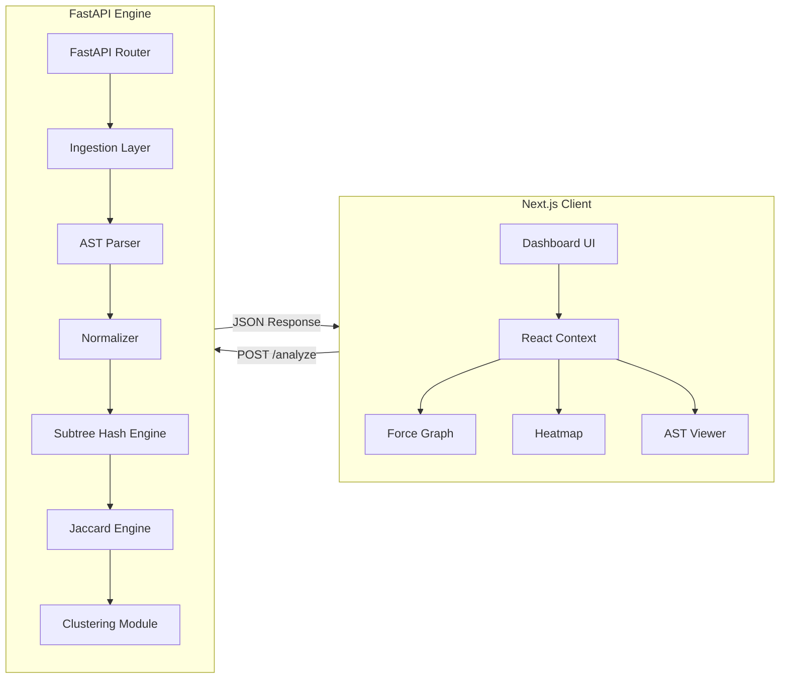
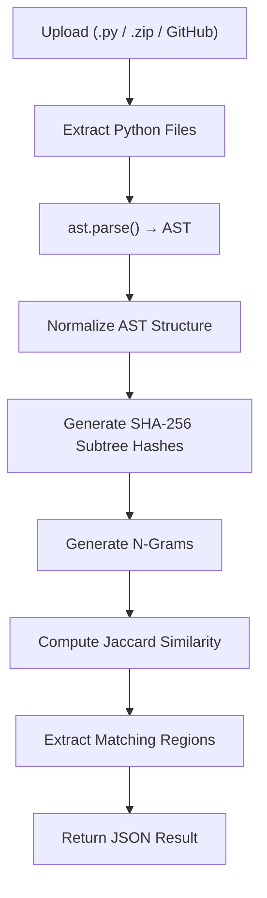
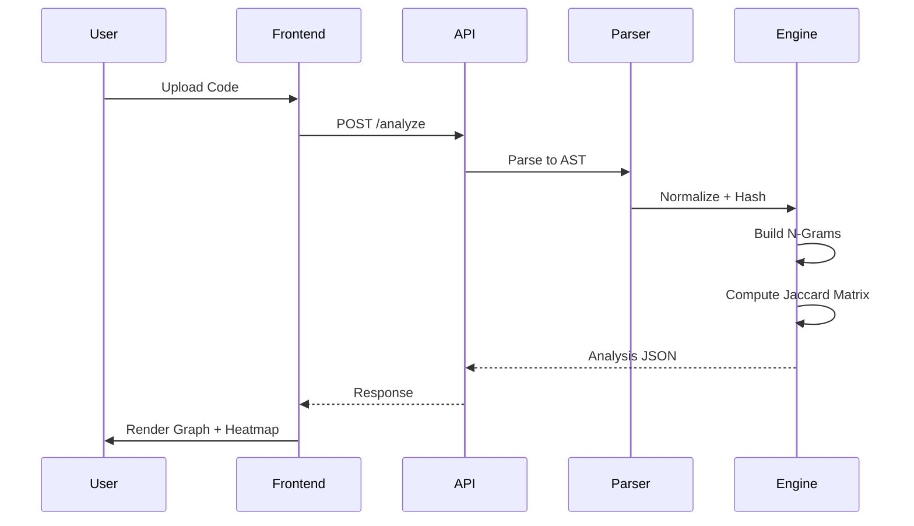
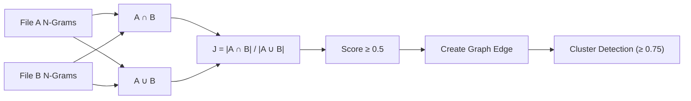

# CLONIQ – Code Similarity Detection Tool

A smart tool that finds copied code by analyzing structure, not just text.

---

## What Problem Does This Solve?

**The Problem:**  
Students and developers sometimes copy code and make small changes (like renaming variables or adding spaces) to hide plagiarism. Normal text comparison tools can't catch these tricks.

**Our Solution:**  
CLONIQ looks at the *structure* of the code (like a blueprint) instead of just the text. Even if someone renames variables or changes formatting, we can still detect if the code logic is the same.

---

## Who Is This For?

- **Universities** – Check student assignments for plagiarism
- **Coding Platforms** – Detect cheating in online tests
- **Companies** – Find duplicate code in large projects
- **Hiring Teams** – Verify candidates write original code

---

## How Does It Work?

Think of code like a building blueprint:

1. **Upload Code** – You give us Python files, zip folders, or GitHub links
2. **Convert to Blueprint** – We turn code into a structural tree (called AST)
3. **Clean It Up** – We remove names and formatting that don't matter
4. **Find Patterns** – We break the structure into small pieces
5. **Compare** – We check how similar different files are
6. **Show Results** – You get a visual map showing which files are copied

---

## System Diagrams

### Full System Architecture



### Processing Pipeline



### Similarity Computation Sequence



### Similarity Graph Logic



### How We Calculate Similarity

```
Similarity Score: J(A, B) = |A ∩ B| / |A ∪ B|
```

**What this means:**
- A = structural patterns from File 1
- B = structural patterns from File 2
- ∩ = patterns that appear in both files
- ∪ = all unique patterns from both files

If two files share 80% of their structural patterns, they get an 80% similarity score.

---

## Technology Used

**Frontend (What You See):**
- Next.js – Modern web framework
- TypeScript – Programming language
- TailwindCSS – Styling
- Interactive graphs and heatmaps

**Backend (The Engine):**
- FastAPI – Fast Python web framework
- Python AST – Converts code to structure
- Jaccard Similarity – Math formula for comparison
- Clustering – Groups similar files together

---

## Features

✅ **Upload Options:**
- Single Python file
- Zip folder with multiple files
- GitHub repository link

✅ **Analysis:**
- Structure-based comparison (not just text)
- Detects renamed variables
- Ignores formatting differences
- Shows matching code regions

✅ **Visualization:**
- Interactive similarity graph
- Color-coded heatmap
- View code structure tree

---

## How to Run It

### Backend Setup

```bash
cd backend
python -m venv venv
source venv/bin/activate
pip install -r requirements.txt
uvicorn main:app --reload --port 8000
```

Open: http://localhost:8000/docs

### Frontend Setup

```bash
cd frontend
npm install
npm run dev
```

Open: http://localhost:3000

---

## API Endpoints (How to Use It)

- **POST /analyze** – Analyze multiple files
- **POST /analyze-pair** – Compare two files
- **POST /compare-zips** – Compare two zip folders
- **POST /compare-github-repos** – Compare GitHub repositories
- **POST /visualize-ast** – See code structure tree

---

## Team

| Name                  | Role               |
| --------------------- | ------------------ |
| ABHIMAN RAJ           | Core Development   |
| AMARTYA MADHAV MISHRA | UI & Design        |
| MRITYUNJAY SAHU       | Backend System     |

---

## Future Plans

🔮 **What's Next:**
- Support more languages (Java, C++, JavaScript)
- Browser extension for code editors
- Integration with learning management systems
- Mobile app version
- Enterprise security features

---

## Why This Matters

📚 **For Education:**  
Helps maintain academic honesty and fair grading

💼 **For Business:**  
Finds duplicate code that wastes storage and maintenance time

🔍 **For Code Review:**  
Automatically detects copy-paste code that should be refactored

---

## How It's Different

| Traditional Tools          | CLONIQ                      |
| -------------------------- | --------------------------- |
| Compares text line-by-line | Compares code structure     |
| Fooled by variable renames | Detects renamed variables   |
| Breaks on formatting       | Ignores whitespace/comments |
| Simple percentage match    | Smart structural analysis   |

---


Even though variable names changed, CLONIQ knows these are the same logic!

---

## License

This project is for educational and research purposes.

---

## Contact & Support

For questions or support, contact the team members listed above.

---

**Made with ❤️ for honest code**