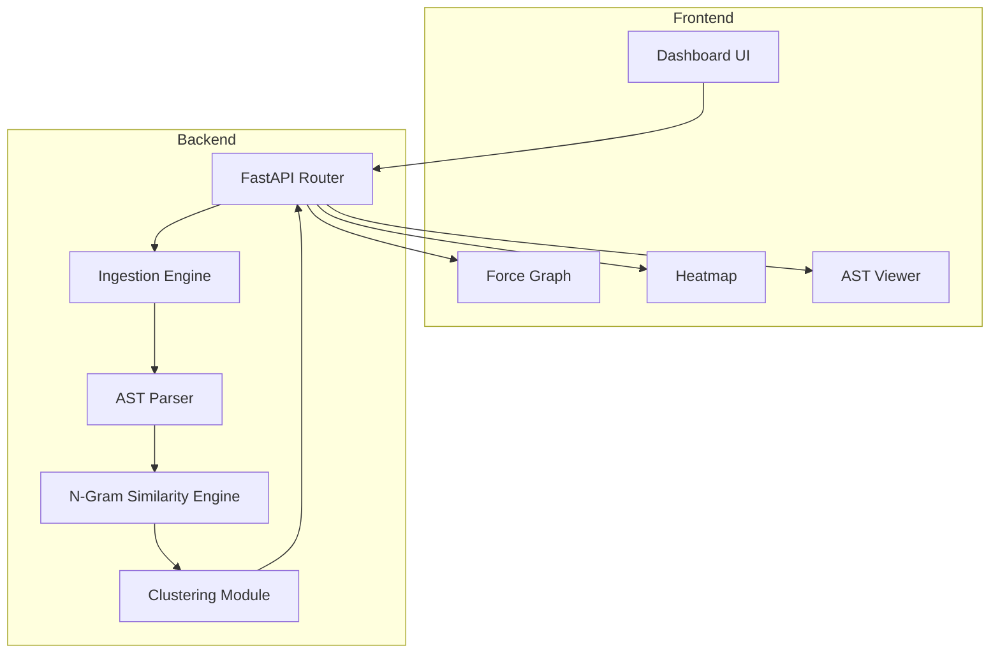

# 🧠 CLONIQ – Structural Code Intelligence Engine

**AST-Based Code Similarity & Plagiarism Detection Platform**

CLONIQ is an advanced structural code analysis engine that detects similarity based on Abstract Syntax Tree (AST) topology rather than text comparison. Unlike traditional diff-based tools, CLONIQ analyzes the *structural blueprint* of code, making it highly resistant to common obfuscation techniques such as variable renaming, formatting changes, comment insertion, and minor reordering.

---

## 1. Problem Statement

### Problem Title
Robust Structural Code Similarity & Plagiarism Detection

### Problem Description
Most existing plagiarism detection systems rely on line-by-line or token-based text comparison. These approaches fail when minor cosmetic modifications are applied to code. Developers, students, and malicious actors can easily bypass such systems through simple obfuscation strategies.

### Target Users
- Universities & Academic Institutions  
- Coding Platforms  
- Hiring & Assessment Platforms  
- Enterprise Code Audit Teams  
- Open Source Maintainers  

### Existing Gaps
- Text-based diff tools fail on variable rename  
- Token comparison sensitive to formatting  
- Manual review not scalable  
- Hash-based approaches too fragile  

---

## 2. Problem Understanding & Approach

### Root Cause Analysis
Code logic is structural, not textual. Two implementations may look visually different while representing identical logic.

### Solution Strategy
CLONIQ:
1. Parses source code into AST
2. Normalizes structure to remove cosmetic differences
3. Converts structure into token sequences
4. Computes similarity using N-Gram & Jaccard Index
5. Performs clustering for anomaly detection
6. Returns unified structured analysis

---

## 3. Proposed Solution

### Solution Overview
CLONIQ consists of:

- FastAPI-based Backend Engine  
- Structural AST Normalization Core  
- N-Gram Jaccard Similarity Engine  
- Clustering Module  
- Next.js Visualization Frontend  

### Core Idea
Normalize → Tokenize → Compare → Cluster → Visualize

### Key Features
- AST-based structural tokenization  
- Anti-obfuscation normalization layer  
- Identifier & constant generalization  
- N-Gram similarity computation  
- Jaccard similarity scoring  
- Force-directed similarity graph  
- Continuous HSL heatmap  
- GitHub repository comparison  
- Zip-to-Zip codebase comparison  
- Recursive AST visualization  

---

## 4. System Architecture

### High-Level Flow
User → Frontend → Backend → AST Engine → Similarity Engine → Response → Visualization

### Architecture Description

**Backend:**
- Ingestion Layer (Files / ZIP / GitHub)
- AST Parser
- Structural Normalizer
- N-Gram Engine
- Jaccard Similarity Matrix Generator
- Clustering Engine

**Frontend:**
- Dashboard UI
- Force-Directed Graph
- Similarity Heatmap
- Recursive AST Viewer



---

## 5. Database Design

**Current Architecture:**

- Stateless design
- In-memory analysis computation

**Future scalable version may include:**

Tables:
- Users
- Analysis Sessions
- File Metadata
- Similarity Results
- Cluster Reports

---

## 6. Dataset

### Dataset Name
User-submitted Python source files

### Sources
- Direct `.py` upload
- `.zip` archive upload
- GitHub public repositories

### Data Type
Structured Python source code

### Preprocessing Steps
- Remove non-python files
- Strip docstrings & comments
- Normalize variable & function identifiers
- Convert AST into structural token vectors

---

## 7. Model Used

### Model Name
AST-Based N-Gram + Jaccard Similarity Model

### Selection Reasoning
- Deterministic
- Scalable
- Computationally efficient
- Obfuscation resistant

### Alternatives Considered
- TF-IDF Vectorization (text-sensitive)
- Tree Edit Distance (computationally expensive)
- Deep Learning Embeddings (opaque & heavy)
- GPT-based comparison (costly & non-deterministic)

### Similarity Formula

```
J(A, B) = |A ∩ B| / |A ∪ B|
```

Where:
- A = N-grams of file 1
- B = N-grams of file 2

---

## 8. Technology Stack

### Frontend
- Electron
- Next.js
- TypeScript
- TailwindCSS
- Framer Motion
- HTML5 Canvas

### Backend
- FastAPI
- Python 3.10+
- Uvicorn

### Structural Engine
- Python AST module
- N-Gram generator
- Jaccard similarity matrix
- Agglomerative clustering

### Deployment
- Frontend: Vercel
- Backend: Docker / VPS
- GitHub API integration

---

## 9. API Documentation

### Endpoints
- `POST /analyze`
- `POST /analyze-pair`
- `POST /compare-zips`
- `POST /compare-github-repos`
- `POST /visualize-ast`

All endpoints return a standardized `AnalysisResult` JSON object.

---

## 10. Development Roadmap

### Phase 1 – Research & Design
- Structural similarity methodology
- AST normalization blueprint
- Metric evaluation

### Phase 2 – Backend Core
- AST parser
- Structural normalizer
- N-Gram generator
- Similarity matrix engine

### Phase 3 – Frontend Analytics Dashboard
- Force graph renderer
- Heatmap visualization
- Recursive AST viewer

### Phase 4 – GitHub Integration
- Repo cloning
- Token-based rate management

### Phase 5 – Deployment
- Environment config
- Docker setup
- Production optimization

---

## 11. End-to-End Workflow

1. User uploads code
2. Backend validates & ingests
3. AST parsing
4. Structural normalization
5. N-gram generation
6. Jaccard similarity computation
7. Similarity matrix creation
8. Clustering
9. JSON payload generated
10. Frontend renders analytics

---

## 12. Demo

- Live Demo: (Add Link)
- Demo Video: (Add Link)
- GitHub Repository: (Add Link)

---

## 13. Deliverables Summary

- Fully functional AST similarity engine
- Structural normalization module
- Visual similarity graph
- Continuous heatmap renderer
- GitHub repository comparison
- Zip batch comparison

---

## 14. Team Roles

| Member Name | Role      | Responsibilities            |
| ----------- | --------- | --------------------------- |
| ABHIMAN RAJ   | FULL-STACK | Core engine development  |
| AMARTYA MADHAV MISHRA    | FRONTEND   | Frontend design & UI      |
| MRITYUNJAY SAHU   | BACKEND  | Backend Design & Development      |


---

## 15. Future Scope

### Short-Term
- Support for C++ / Java
- Tree edit distance hybrid model
- Performance benchmarking

### Long-Term
- IDE plugin integration
- LMS integration APIs
- Enterprise audit suite
- Cross-language structural fingerprinting

---

## 16. Known Limitations

- Currently Python-only
- Structural similarity ≠ runtime semantic equivalence
- Large repositories may require batching optimization

---

## 17. Impact

- Academic integrity enforcement
- Automated enterprise code audits
- Large-scale repository deduplication
- Structural-level code intelligence analysis

---

## Getting Started

### Backend

```bash
cd backend
python -m venv venv
source venv/bin/activate
pip install -r requirements.txt
cp .env.example .env
uvicorn main:app --reload --port 8000
```

Visit: [http://localhost:8000/docs](http://localhost:8000/docs)

### Frontend

```bash
cd frontend
npm install
npm run dev
```

Visit: [http://localhost:3000](http://localhost:3000)

